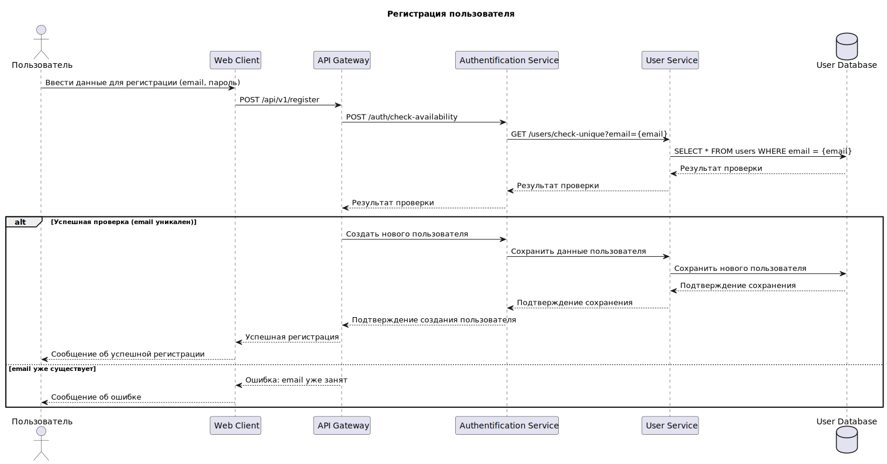
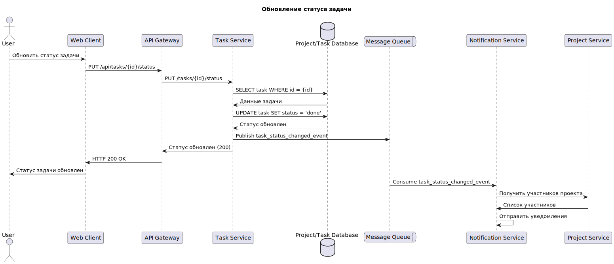
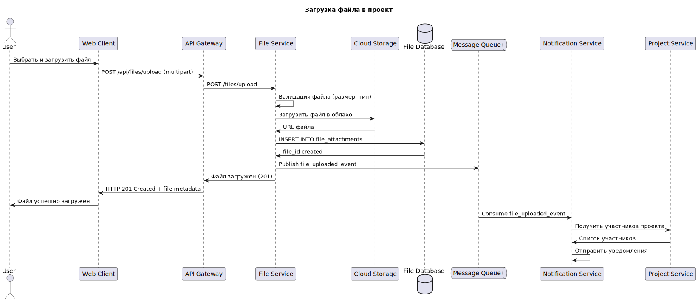

:toc: macro
= Содержание
:sectnums:

toc::[]

== Обзор системы

*TeamSync* — платформа для менеджеров проектов и членов команд, которая предназначена для повышения эффективности взаимодействия между участниками проектов, планирования задач и отслеживания прогресса.

== Цель системы
* Оптимизировать процесс управления проектами от планирования до завершения.
* Обеспечить эффективную коммуникацию внутри команд.
* Повысить прозрачность и отслеживаемость прогресса по задачам.
* Централизовать хранение проектных документов и ресурсов.

== Описание заинтересованных сторон

.Основные заинтересованные стороны
[width="100%",cols="1,1,5,5,4"]
|===

|# | Заинтересованная Сторона | Описание | Интересы | Влияние на Проект

|{counter:R4} | **Менеджеры Проектов** | Конечные пользователи, использующие систему для планирования, управления и отслеживания проектов | Эффективные инструменты планирования, отслеживания прогресса, управления задачами, удобные отчеты | Высокое (определяют основные функциональные требования, активно используют систему)
|{counter:R4} | **Члены Команд** | Конечные пользователи, выполняющие задачи и работающие с документами в рамках проектов | Интуитивно понятный интерфейс, удобные инструменты для выполнения задач, эффективные средства коммуникации, доступ к документам | Высокое (определяют требования к юзабилити и удобству выполнения задач)
|{counter:R4} | **Руководство Компании** | Высшее руководство, заинтересованное в общей эффективности управления проектами и продуктивности команд | Повышение производительности, снижение затрат, доступ к агрегированным данным о прогрессе проектов, аналитика | Высокое (принимают стратегические решения, выделяют бюджет, устанавливают общие цели)
|{counter:R4} | **Отдел Продаж** | Заинтересованы в демонстрации возможностей платформы потенциальным клиентам | Привлекательный дизайн, уникальные функции | Среднее (предоставляют обратную связь по рыночным требованиям)
|{counter:R4} | **Отдел Разработки** | Команда, ответственная за проектирование, разработку, тестирование и развертывание системы | Четкие требования, масштабируемая архитектура, удобные инструменты разработки, стабильная работа системы | Высокое (техническая реализация, определение архитектурных ограничений)
|{counter:R4} | **Отдел Поддержки** | Команда, ответственная за поддержание работоспособности системы, мониторинг и оказание поддержки пользователям | Легкость развертывания, мониторинга, отладки, документированность, стабильность | Высокое (определяют требования к надежности, производительности, поддерживаемости)
|{counter:R4} | **Владелец Продукта** | Лицо, ответственное за определение и приоритизацию функциональности системы | Полное соответствие продукта потребностям пользователей и бизнеса, успешное внедрение | Высокое (принимает решения по функционалу, приоритетам)
|{counter:R4} | **Специалисты по безопасности** | Заинтересованы в защите данных и системы от угроз | Строгие стандарты безопасности, аудит, защита от уязвимостей | Высокое (определяют требования к безопасности, проводят аудит)
|===

== Бизнес-процессы

*{counter:R2}. Процесс регистрации и создания профилей пользователей*

* Регистрация пользователя
* Заполнение данных о пользователе
* Назначение роли пользователя и прав доступа

*{counter:R2}. Процесс создания и настройки проекта*

* Создание проекта
* Определение целей и объема работ
* Назначение команды проекта

*{counter:R2}. Процесс планирования задач*

* Декомпозиция проекта на задачи
* Установка приоритетов и зависимостей
* Назначение ответственных исполнителей
* Определение временных рамок

*{counter:R2}. Процесс выполнения задач*

* Получение уведомлений о назначенных задачах
* Обновление статуса выполнения
* Загрузка результатов работы
* Коммуникация с командой

*{counter:R2}. Процесс мониторинга и контроля*

* Отслеживание прогресса выполнения
* Анализ отклонений от плана
* Корректировка планов при необходимости
* Генерация отчетов

*{counter:R2}. Процесс завершения проекта*

* Финальная проверка результатов
* Архивирование проектных материалов
* Анализ эффективности проекта

== Функциональные требования

*FR-001: Регистрация пользователей*

Описание: Система должна поддерживать регистрацию, аутентификацию и авторизацию пользователей с различными ролями. 

Приоритет: Высокий

Критерии приемки:

* Регистрация новых пользователей
* Вход в систему по логину/паролю
* Управление профилями пользователей
* Назначение ролей и прав доступа

*FR-002: Создание профиля пользователя*

Приоритет: Высокий

Описание: Система должна позволять создавать и редактировать профили пользователей.

Критерии приемки:

* Создание нового профиля пользователя
* Редактирование информации о пользователе

*FR-003: Управление проектами*

Приоритет: Высокий

Описание: Система должна позволять создавать, редактировать и удалять проекты.

Критерии приемки:

* Создание нового проекта
* Редактирование информации о проекте
* Удаление проекта
* Настройка доступа к проекту
* Архивирование завершенных проектов

*FR-004: Управление задачами*

Приоритет: Высокий

Описание: Система должна обеспечивать полный жизненный цикл управления задачами.

Критерии приемки:

* Создание задач с описанием и приоритетом
* Назначение исполнителей
* Установка сроков выполнения
* Отслеживание статуса выполнения

*FR-005: Календарное планирование*

Приоритет: Средний

Описание: Система должна предоставлять календарь для планирования встреч.

Критерии приемки:

* Отображение задач в календарном виде
* Планирование встреч и событий
* Интеграция с внешними календарями

*FR-006: Уведомления и контроль сроков*

Приоритет: Средний

Описание: Система должна отправлять уведомления пользователям о изменениях в задачах и проектах.

Критерии приемки:

* Уведомления об изменениях
* Уведомления о важных событиях
* Уведомления о приближающихся дедлайнах

*FR-007: Хранение документов*

Приоритет: Средний

Описание: Система должна обеспечивать хранение и управление проектными документами.

Критерии приемки:

* Загрузка файлов различных форматов
* Организация файлов по папкам
* Контроль версий документов
* Контроль доступа к файлам

*FR-008: Коммуникационные инструменты*

Приоритет: Высокий

Описание: Система должна предоставлять инструменты для общения участников проекта.

Критерии приемки:

* Чаты для коммуникации по проектам и задачам
* Поддержка комментариев к задачам
* Возможность создания видеоконференций

*FR-009: Отчетность и аналитика*

Приоритет: Средний

Описание: Система должна генерировать отчеты о ходе выполнения проектов.

Критерии приемки:

* Дашборды с ключевыми метриками
* Отчеты по проектам и задачам
* Анализ загрузки ресурсов
* Экспорт отчетов в различные форматы

*FR-010: Управление временем*

Приоритет: Средний

Описание: Система должна поддерживать учет времени, затраченного на задачи.

Критерии приемки:

* Трекинг времени по задачам
* Трудозатраты сотрудников
* Планирование рабочего времени

*FR-011: Интеграции*

Приоритет: Низкий

Описание: Система должна поддерживать интеграцию с внешними сервисами.

Критерии приемки:

* Интеграция с почтовыми сервисами
* Интеграция с системами контроля версий
* API для интеграции с внешними системами

*FR-012: Мобильное приложение*

Приоритет: Средний

Описание: Система должна иметь мобильное приложение для основных функций.

Критерии приемки:

* Просмотр и обновление задач
* Уведомления
* Синхронизация с веб-версией

*FR-013: Шаблоны проектов*

Приоритет: Низкий

Описание: Система должна поддерживать создание и использование шаблонов проектов.

Критерии приемки:

* Создание шаблонов на основе существующих проектов
* Библиотека готовых шаблонов
* Быстрое создание проектов из шаблонов

== Нефункциональные требования

*NFR-001: Производительность*

Описание: Система должна обеспечивать высокую производительность при работе множества пользователей. 

Критерии:

* Время отклика интерфейса не более 2 секунд
* Поддержка до 10,000 одновременных пользователей
* Время загрузки страниц не более 3 секунд

*NFR-002: Надежность*

Описание: Система должна обеспечивать высокую доступность и отказоустойчивость.

Критерии:

* Время доступности 99.9% (SLA)
* Автоматическое восстановление после сбоев
* Резервное копирование данных каждые 24 часа

*NFR-003: Безопасность*

Описание: Система должна обеспечивать защиту данных и конфиденциальность информации.

Критерии:

* Шифрование данных при передаче
* Двухфакторная аутентификация
* Аудит действий пользователей

*NFR-004: Совместимость*

Описание: Система должна поддерживать различные платформы и браузеры.

Критерии:

* Поддержка современных браузеров (Chrome, Firefox, Safari, Edge)
* Совместимость с iOS и Android

*NFR-005: Удобство использования*

Описание: Интерфейс системы должен быть интуитивно понятным и удобным.

Критерии:

* Соответствие принципам UX/UI дизайна
* Поддержка множественных языков

*NFR-006: Масштабируемость*

Описание: Система должна легко масштабироваться при росте нагрузки.

Критерии:

* Горизонтальное масштабирование компонентов
* Автоматическое масштабирование при увеличении нагрузки
* Микросервисная архитектура
* Поддержка облачной инфраструктуры

*NFR-007: Соответствие стандартам*

Описание: Система должна соответствовать отраслевым стандартам и регуляторным требованиям.

Критерии:

* Соответствие GDPR для обработки персональных данных
* Соответствие стандартам ISO 27001
* Соответствие требованиям к ПО согласно 152-ФЗ
* Интеграция с LDAP/Active Directory

*NFR-008: Сопровождение*

Описание: Система должна поддерживать простоту сопровождения и развития.

Критерии:

* Документированный код и API
* Автоматизированное тестирование
* CI/CD pipeline для развертывания
* Мониторинг и логирование системных событий

== Архитектура системы

Система TeamSync построена на принципах микросервисной архитектуры, что обеспечивает:

* Слабую связанность между компонентами
* Высокую масштабируемость отдельных сервисов
* Независимое развертывание компонентов
* Технологическое разнообразие для оптимального решения задач

.C4 Architecture - Context Diagram
image::diagrams\svg\C4_Context.svg[]

.C4 Architecture - Container Diagram
image::diagrams\svg\C4_Container.svg[]

== Структура базы данных

.ER-диаграмма
image::diagrams\svg\ER.svg[]

== Взаимодействие компонентов

*Диаграмма последовательности: Регистрация пользователя*

.Регистрация пользователя

_Участники процесса:_

_User (User):_ Пользователь, который инициирует процесс регистрации.

_Web Client (WC):_ Веб-интерфейс, через который пользователь вводит свои данные.

_API Gateway (API):_ Единая точка входа для всех запросов к бэкенд-сервисам, маршрутизирует запросы и обеспечивает безопасность.

_Authentication Service (Auth):_ Сервис, отвечающий за аутентификацию, авторизацию пользователя.

_User Service (US):_ Микросервис, управляющий данными пользователей.

_User Database (UB):_ База данных, в которой хранятся все данные о пользователях.

*Диаграмма последовательности: Создание задачи*

.Создание задачи
image::diagrams\svg\create_task.svg[]

_Участники процесса:_

_User (User):_ Пользователь, который инициирует процесс создания задачи.

_Web Client (WC):_ Веб-интерфейс, через который пользователь вводит данные.

_API Gateway (API):_ Единая точка входа для всех запросов к бэкенд-сервисам, маршрутизирует запросы и обеспечивает безопасность.

_Task Service (TS):_ Микросервис, управляющий данными задач.

_Project/Task Database (PTDB):_ База данных, в которой хранятся все данные о проектах и задачах.

_Message Queue (MQ):_ Очередь сообщений, используемая для асинхронной связи между микросервисами, для отправки уведомлений.

_Notification Service (NS):_ Сервис, отвечающий за отправку уведомлений пользователям.

_Project Service (PS):_ Микросервис, управляющий проектами и их структурой.

*Диаграмма последовательности: Обновление статуса задачи*

.Обновление статуса задачи

_Участники процесса:_

_User (User):_ Пользователь, который инициирует процесс обновления статуса задачи.

_Web Client (WC):_ Веб-интерфейс, через который пользователь вводит данные.

_API Gateway (API):_ Единая точка входа для всех запросов к бэкенд-сервисам, маршрутизирует запросы и обеспечивает безопасность.

_Task Service (TS):_ Микросервис, управляющий данными задач.

_Project/Task Database (PTDB):_ База данных, в которой хранятся все данные о проектах и задачах.

_Message Queue (MQ):_ Очередь сообщений, используемая для асинхронной связи между микросервисами, для отправки уведомлений.

_Notification Service (NS):_ Сервис, отвечающий за отправку уведомлений пользователям.

_Project Service (PS):_ Микросервис, управляющий проектами и их структурой.

*Диаграмма последовательности: Загрузка файла в проект*

.Загрузка файла в проект

_Участники процесса:_

_User (User):_ Пользователь, который инициирует процесс загрузки файла в проект.

_Web Client (WC):_ Веб-интерфейс, через который пользователь загружает.

_API Gateway (API):_ Единая точка входа для всех запросов к бэкенд-сервисам, маршрутизирует запросы и обеспечивает безопасность.

_File Service (FS):_ Микросервис, отвечающий за обработку загрузки, хранение и управление файлами.

_Cloud Storage (CS):_ Облачное хранилище, где фактически хранятся файлы.

_File Database (FDB):_ База данных, в которой хранятся метаданные о файлах.

_Message Queue (MQ):_ Очередь сообщений, используемая для асинхронной связи между микросервисами, для отправки уведомлений.

_Notification Service (NS):_ Сервис, отвечающий за отправку уведомлений пользователям.

_Project Service (PS):_ Микросервис, управляющий проектами и их структурой.

== BPMN Диаграмма бизнес-процесса
https://modeler.camunda.io/share/c0525e5a-e0dd-4f7d-8323-066b54f8b5ad